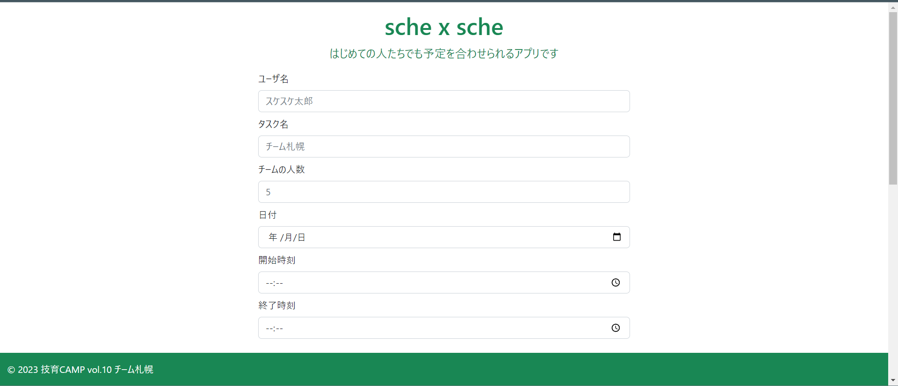
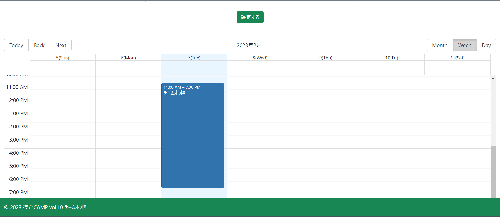

# sche x sche
- スケジュール管理アプリ「sche x sche」です．
- ハッカソン即席チーム「チーム札幌」による作品です．
- ハッカソン後，山本が適当に手を加えました
（docker 環境構築 & frontend & backend の改変）
## 機能
フロントエンド側から「名前・タスク・日程・開始時刻・終了時刻」を入力し，
バックエンド側の API を通して DB に保存します．
タスクに割り当てられた全員が日程回答をすれば，フロントに結果を返し，通知したのちカレンダーに自動的に追加します．
（全員分の日程回答はポーリングにより監視）
## 使用技術
- インフラ「Docker」
- フロント「React」
- バックエンド「fastAPI + SQLite」

# 実行
1. このリポジトリ（mainブランチ）を clone 後，`docker compose up -d` で起動
2. `localhost:3000` にアクセス
## 全体像
こんな感じです．

